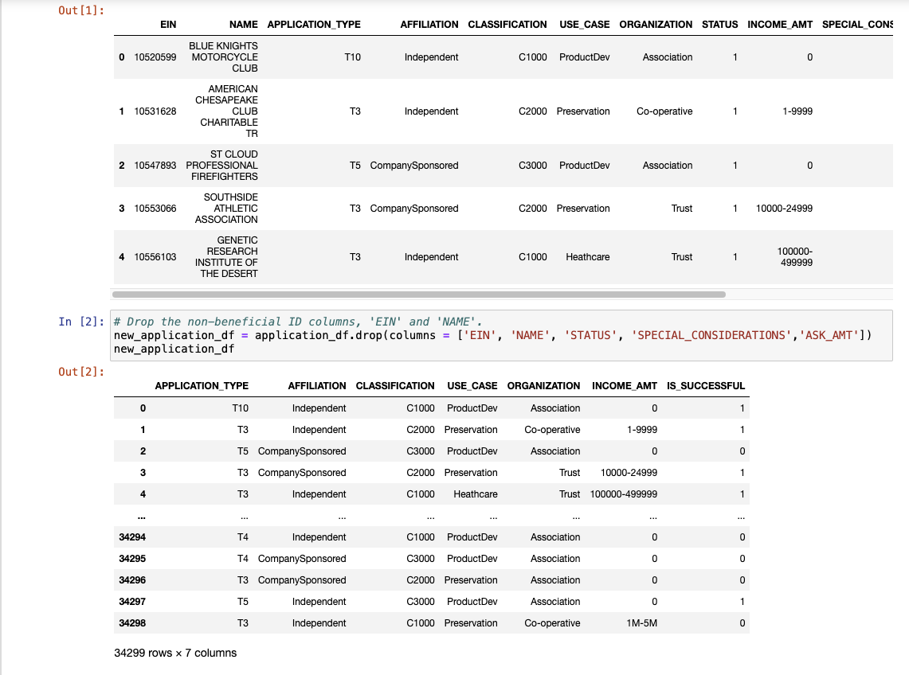
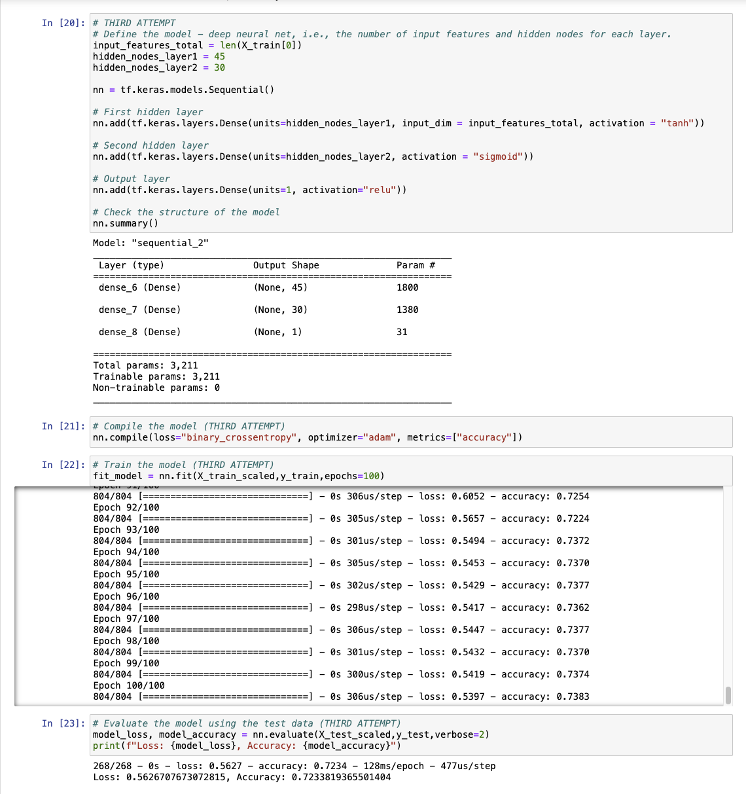

# Deep Learning Challenge

Alphabet Soup, a nonprofit foundation, requires a tool utilizing machine learning and neural networks to assist in identifying the most promising funding applicants among more than 34,000 organizations that have received funding from them in the past. Your task involves using the provided dataset's features to construct a binary classifier capable of predicting the success potential of applicants funded by Alphabet Soup.

Provided by Alphabet Soup's business team, the CSV dataset contains diverse columns detailing metadata for each organization, including identification markers like EIN and NAME, along with specifics such as APPLICATION_TYPE, AFFILIATION indicating the sector of industry, CLASSIFICATION denoting the government organization classification, USE_CASE outlining the purpose of funding, ORGANIZATION type, STATUS indicating the active standing, INCOME_AMT signifying income classification, SPECIAL_CONSIDERATIONS detailing any special aspects of the application, ASK_AMT indicating the funding amount requested, and IS_SUCCESSFUL denoting the effective use of the funding.

Instructions:

Phase 1: Data Preprocessing
Begin by uploading the initial file to Google Colab. Use the provided information in the Challenge files to execute the preprocessing steps.

* Load the charity_data.csv into a Pandas DataFrame and identify:

    * Target variable(s) for your model
    * Feature variable(s) for your model
    * Drop the EIN and NAME columns.
* Determine the count of unique values for each column.

* For columns with over 10 unique values:

    * Assess the count of data points for each unique value.
    * Define a cutoff point based on data point counts to categorize "rare" categorical variables into a new value, "Other." Verify the success of this binning process.
* Utilize pd.get_dummies() to encode categorical variables.

* Split the preprocessed data into feature array X and target array y. Use the train_test_split function to divide the data into training and testing datasets.

* Scale the training and testing features datasets using StandardScaler. Create an instance, fit it to the training data, and then use the transform function.

Phase 2: Model Compilation, Training, and Evaluation
Utilize TensorFlow to construct a neural network, enabling binary classification for predicting Alphabet Soup-funded organizations' success based on dataset features.

* In Google Colab, utilize the file where the preprocessing steps were performed in Phase 1.

* Design a neural network model by defining the number of input features and nodes for each layer using TensorFlow and Keras.

* Establish the first hidden layer and select an appropriate activation function.

* Optionally, include a second hidden layer with an appropriate activation function.

* Create an output layer with a suitable activation function.

* Review the model's structure.

* Compile and train the model.

* Implement a callback to save the model's weights every five epochs.

* Evaluate the model's performance using the test data to compute loss and accuracy.

* Save and export the results to an HDF5 file named AlphabetSoupCharity.h5.

Phase 3: Model Optimization
Optimize the model leveraging TensorFlow to achieve a target predictive accuracy exceeding 75%. You can utilize the following methods:

* Adjust input data to eliminate variables or outliers causing confusion in the model, such as:
    * Dropping more or fewer columns.
    * Creating additional bins for rare occurrences in columns.
    * Adjusting the number of values for each bin.
* Increase neurons in a hidden layer or add more hidden layers.
* Experiment with different activation functions for the hidden layers.
* Modify the number of epochs in the training regimen.

# Deep Learning Challenge Report 
### Overview 
    Alphabet Soup, a nonprofit organization, aims to enhance its grant distribution system through the utilization of machine learning and neural networks. My responsibility involved developing a binary classifier using the given dataset to pinpoint prospective grant beneficiaries most likely to succeed when assisted by Alphabet Soup.

    Collaborating closely with Alphabet Soup's business team, I was granted access to a CSV file encompassing information about over 34,000 organizations that have previously received funding from Alphabet Soup. This dataset comprises various columns filled with essential metadata for each of these organizations.

### Results 
   * Data Preprocessing

    1. Which variable(s) serve as the target(s) for your model?
    The target variable is derived from the 'IS_SUCCESSFUL' column within the DataFrame.

    2. Which variable(s) constitute the features for your model?
    The feature variables encompass all columns present in the DataFrame, excluding the 'IS_SUCCESSFUL' column, which has been eliminated during data preprocessing.

    3. Which variable(s) were omitted from the input data as they neither represent targets nor features?
    Both the 'EIN' and 'NAME' columns were removed from the dataset as they didn't function as either target variables or features in the dataset.

   

    * Model Compilation, Training, and Evaluation
    
    1. What were your choices concerning neurons, layers, and activation functions for the neural network model, and why?

    Initially, I opted for 18 hidden nodes in the first layer and 15 hidden nodes in the second layer, acknowledging that these selections were somewhat arbitrary. These choices served as starting points for subsequent iterations and adjustments aimed at refining the neural network model in the subsequent attempts.

    2. Did you achieve the targeted model performance?

    Unfortunately, I fell short of reaching the intended 75% model accuracy. I could only shoot for a 72% accuracy rate with my attempts.

    3. What strategies did you employ to enhance model performance?

    I implemented various alterations to boost the model's accuracy. This involved adding more layers, eliminating additional columns, incorporating extra hidden nodes, and experimenting with diverse activation functions for each layer. These adjustments were made with the primary goal of improving the model's predictive capabilities.

### Summary
In summary, the deep learning model achieved an accuracy of approximately 72% in predicting the classification problem. To achieve higher prediction accuracy, it would be advisable to improve the correlation between the input and output. This could involve more comprehensive data preprocessing, exploring different activation functions, and iterating on the model until a higher level of accuracy is achieved.

## How to Install and Run the script

To run this script:
1. Copy the git link in your local git repository
2. Ensure *Deep_Learning_Challenge* directory, *AlphabetSoupCharity.ipynb* and *AlphabetSoupCharity_Optimization.ipynb* files are present
3. Ensure the respective h5 format output files are present in the *Deep_Learning_Challenge* folder
4. Run the script using **Google Colab** from *Deep_Learning_Challenge* directory and view results
5. Run each block of code individually starting from the very top 

## Credits

To write this script, I used the starter code provided and followed the challenge requirements meticulously. I did refer to the solution file to verify if my results were correct   
